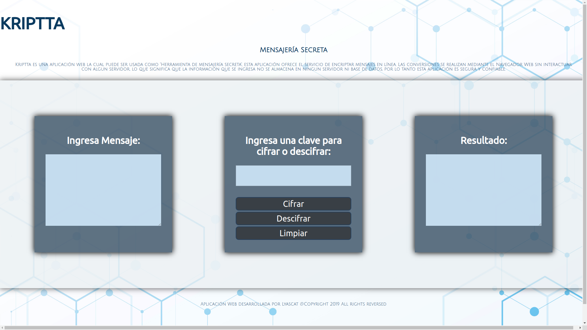
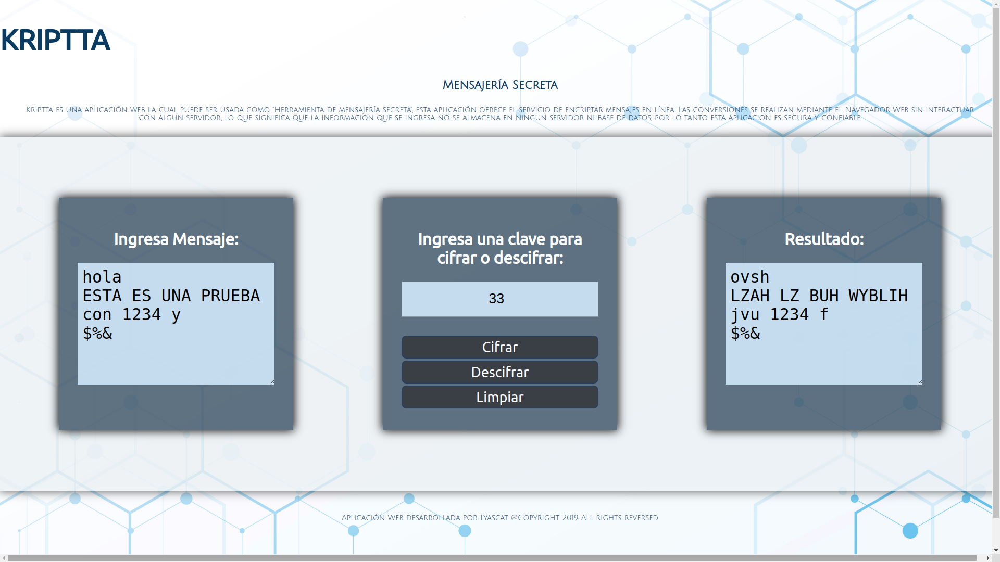
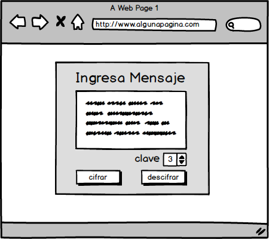
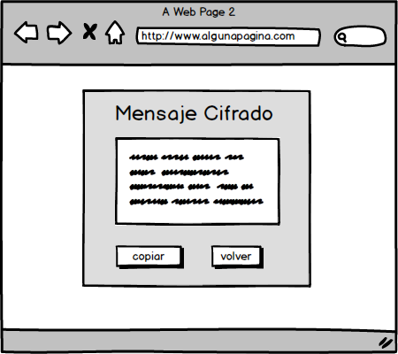
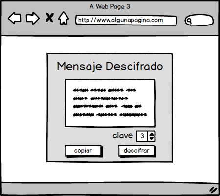

# Kriptta

## Índice

* [1. Resumen del proyecto](#1-resumen-del-proyecto)
* [2. Investigación UX](#2-investigacion-ux)
* [3. Objetivos de aprendizaje](#3-objetivos-de-aprendizaje)

***

## 1. Resumen del Proyecto

Kriptta es una aplicación web la cual puede ser usado como "Herramienta de mensajería secreta", esta aplicación ofrece el servicio de encriptar mensajes en línea.

Las conversiones se realizan mediante el Navegador Web las cuales pueden ser "Google Chrome o Mozilla Firefox" sin interactuar con algun servidor, lo que significa que la información que se ingresa no se almacena en ninguna base de datos, por lo tanto esta aplicación es segura y confiable.

Puedes encriptar datos privados como números de teléfono, direcciones, correos, etc. Incluso puedes usar esta herramienta para generar una contraseña segura. Por ejemplo, puedes ingresar una frase y una clave para cifrar la frase, el resultado cifrado puedes usarlo como contraseña.

### Proyecto Final

A continación se muestra en la siguiente imagen la vista del resultado final del proyecto.

## 2. Investigación UX:

### Usuario Objetivo

Esta herramientas esta dirigida para un público en general: Jovenes y adultos quienes tengan nececidades de enviar mensajes privados. 

### ¿Cómo se solucionan los problemas y/o necesidades de los usuarios?

Los usuarior que desean enviar mensajes con datos privados como números de teléfono, direcciones, correos, número de cuentas bancarias o información privilegiada, etc. puede hacer uso de esta herramienta de encriptación. Incluso se puede usar esta herramienta para generar contraseñas seguras. Por ejemplo, se puede ingresar una frase y una clave para cifrar la frase, el resultado puede ser usardo como contraseña. Lo bueno de hacer uso de esta herramienta de encriptación, es que al ingresar la información y las concersiones de las mismas se realizan en un navegador Web, lo que significa que la información no es almacenada en ningun servidor y por tanto su uso es seguro y confiable.

#### Primer Prototipo

A continuación se muestra las primeras vistas del primer prototipado:

* Como primera vista se ha diseñado un cuadro para el ingres del Mensaje "Ingresa Mensaje" el cual contiene una caja de texto para que el usario ingrese el mensaje, una entrada para el ingreso de una clave (offset) y dos botones para la aplicación del crifrado y descifrado.

* Como segunda vista, se ha diseñado un cuadro que contiene el resultado del cifrado, el cual contiene una caja de texto para el resultado del mensaje cifrado y dos bontones, uno para "copiar" el mensaje y otro para "volver" al principio.

* Como tercera vista, se ha diseñado un cuadro que contiene el resultado del Mensaje Descifrado, este como resultado de la primera vista. Este contiene un cuadro de texto que muesta el mensaje descifrado y tiene dos botones, unno para "copiar" el mensaje y otro para "volver" al principio.

*Feedback recibido y las mejoras a realizar
El feedback fue realizado con compañeras de squad, de quienes se obtuvo las siguientes mejoras:

1. Se recomendó que las 3 vistas se muestre en una sola y que esta se vea de manea horizontal.
2. Se tomo la sugerencia de que la presentación de las vistas sea semejante a la vista del Google traductor.

El resultado se muestra en la siguiente sección.

#### Segundo Prototipo

De las sugerencias obtenidas en el Feedback con las compañeras de squad, se realizó el siguiente prototipado.

* Como se puede obervar, se tomó las sugerencias recibidas en el feedback, las vistas mostrada anteriormente se estableció en una sola.

* Se agrego el nombre del proyecto "Kripta" y además se agregó una breve descripción del proyecto 
* La interacción de los botones es solo en una sola vista asi como el ingreso de la clave segura.

## 3. Objetivos de aprendizaje

El objetivo principal de aprendizaje es adquirir experiencia desarrollando aplicaciones web (WebApp) que interactúen con el usuario a través del navegador y la lógica, utilizando HTML5, CCS3 y JavaScript como herramientas.

A continuación se muestra los objetivos que se ha llegado a
**entender** y **aplicar** en este proyecto.

### UX

- [ ] Diseñar la aplicación pensando y entendiendo al usuario.
- [X] Crear prototipos para obtener feedback e iterar.
- [X] Aplicar los principios de diseño visual (contraste, alineación, jerarquía).

### HTML y CSS

- [X] Uso correcto de HTML semántico.
- [X] Uso de selectores de CSS.
- [ ] Construir tu aplicación respetando el diseño realizado (maquetación).

### DOM

- [X] Uso de selectores del DOM.
- [X] Manejo de eventos del DOM.
- [ ] Manipulación dinámica del DOM.

### Javascript

- [X] Manipulación de strings.
- [X] Uso de condicionales (if-else | switch).
- [X] Uso de bucles (for | do-while).
- [X] Uso de funciones (parámetros | argumentos | valor de retorno).
- [X] Declaración correcta de variables (const & let).

### Testing
- [ ] Testeo de tus funciones.

### Git y GitHub
- [ ] Comandos de git (add | commit | pull | status | push).
- [ ] Manejo de repositorios de GitHub (clone | fork | gh-pages).

### Buenas prácticas de desarrollo
- [ ] Uso de identificadores descriptivos (Nomenclatura | Semántica).
- [ ] Uso de linter para seguir buenas prácticas (ESLINT).
